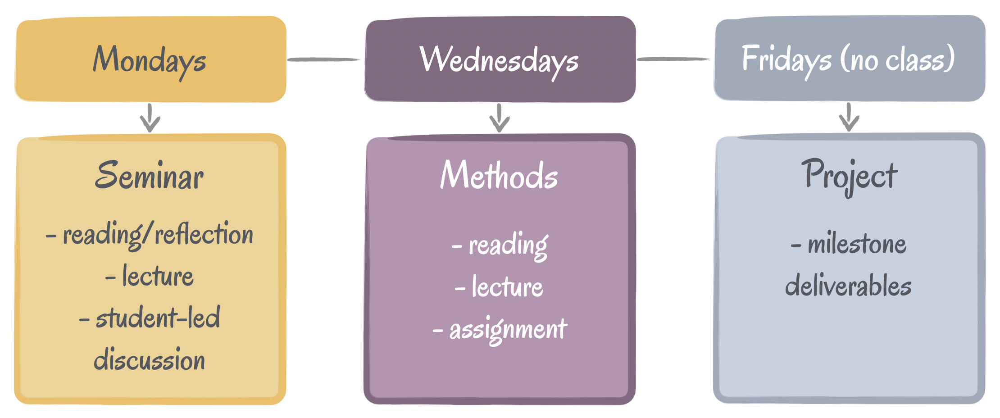

## Welcome to CS-770 Human-Computer Interaction!

This course introduces graduate students in computer science, psychology, educational psychology, and related disciplines to research topics, principles, and methods in human-computer interaction (HCI). HCI is an interdisciplinary area concerned with understanding how humans interact with computing systems and designing technologies that support and enrich human life. Research in HCI examines social, cognitive, and physical phenomena surrounding technology use with the dual goals of understanding impact and creating guidelines for the design and evaluation of interactive systems.
The course is organized into three modules:

1. **Seminar** — You will engage with major research topics in HCI through weekly readings and student-led discussions. Preparation involves creating a discussion-provoking slide each week that demonstrates your ability to apply, critique, and extend the readings.

2.	**Methods** — You will gain hands-on experience with qualitative and quantitative human-subjects research methods through lectures, tutorials, and weekly assignments. Each assignment begins in class and is completed individually outside of class, giving you the opportunity to practice applying research methods in realistic scenarios.

3.	**Project** — Working in small groups, you will conduct a semester-long research project in a critical or emerging domain of computing. The project will involve applying HCI methods, prototyping, conducting studies with human subjects, and culminates in an ~8-page research paper in ACM Proceedings format.

The course is designed primarily for graduate students in computer science, psychology, and educational psychology. Advanced undergraduates (with significant research experience and/or enrollment in the L&S Honors program) and graduate students from other programs may take the course with permission of the instructor. These students should meet with the instructor after the first class session or during the first office hours of the semester to discuss enrollment.

### Course Resources

<table>
<tr>
	<td>
		<a class="btn btn-blue" href="https://canvas.wisc.edu/courses/475834">Course Canvas Page</a>
	</td>
	<td>
		<a class="btn btn-blue" href="https://piazza.com/wisc/fall2025/cspsychedpsych770">Course Piazza Page</a>
	</td>
  <td>
		<a class="btn btn-blue" href="mailto:hci-class@cs.wisc.edu">Email instructor/TA</a>
	</td>
	<td>
		<a class="btn btn-blue" href="https://www-sciencedirect-com.ezproxy.library.wisc.edu/book/9780128053904/research-methods-in-human-computer-interaction">Course Textbook</a>
	</td>
</tr>
</table>

<table>
<tr>
	<td>
		<a class="label" href="">Course location</a>
	</td>
	<td>
		MW 1:00 pm – 2:15 pm, Morgridge B2590
	</td>
</tr>
<tr>
	<td>
		<a class="label" href="">Instructor office hours</a>
	</td>
	<td>
		M 2:15 - 3:00 pm, Morgridge 2513
	</td>
</tr>
<tr>
	<td>
		<a class="label" href="">TA office hours</a>
	</td>
	<td>
		Mondays 2:30-3:30pm, <a href="https://uwmadison.zoom.us/j/96018953831?pwd=cFozMHJzQmpaNGVXMm9MQkpjY1NsZz09">Zoom</a> 
		Wednesdays 2:30-3:30pm — Morgridge 2513
	</td>
</tr>
</table>

